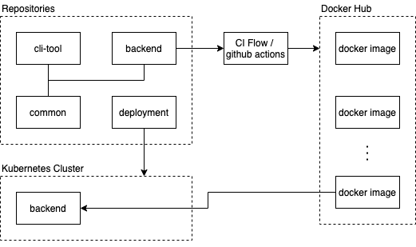

  

# Template7-Intruction

Overall introduction of the project Temaplate7.

 
 

The project Template7 is a template of the microservice software product, include dockerize and deployment.

CI flow uses github actions, once the condition matched, the CI flow will be trigger, it builds docker image from the souce code then push to the dockerhub.

Use [Helm](https://helm.sh/) as deployment tool.

## Overall Design

| Component | Describtion |
| :---: | :--- |
| [Backend](https://github.com/Template7/backend) | Core backend service. |
| [Cli-Tool](https://github.com/Template7/cli-tool) | Customized CLI tool for the project, such like DB indexes / data initialize. |
| [Common](https://github.com/Template7/common) | Common lib of the project. |
| [Deployment](https://github.com/Template7/deployment) | Project deployment manifest. |
